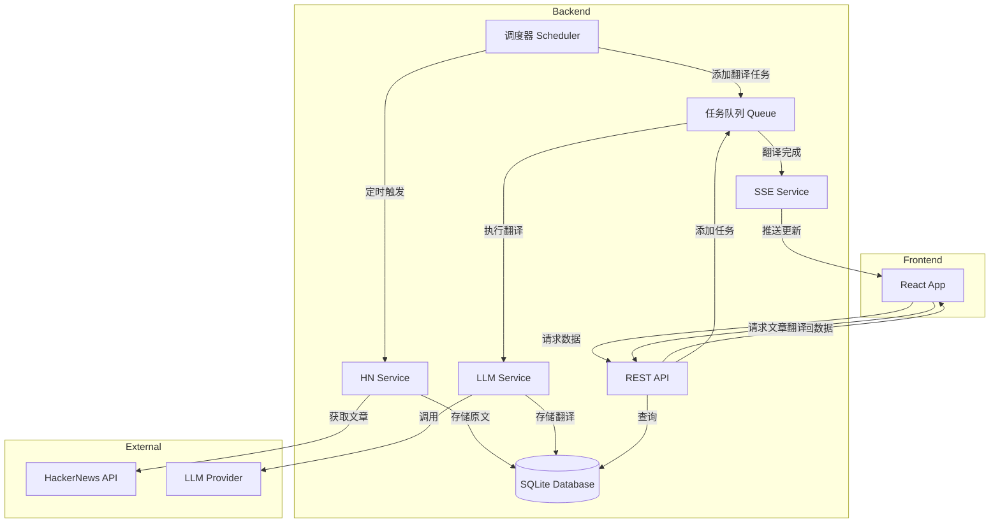

# Design Document: Producer-Consumer Architecture Refactor

## Overview

本设计文档描述了 HackerNewsCN 项目从混合架构重构为生产者-消费者模式的技术方案。

核心思想：
- **生产者**：后端调度器（Scheduler）定时抓取 HN 文章，自动翻译标题，存入数据库
- **消费者**：前端通过 API 获取已翻译的数据，通过 SSE 接收实时更新
- **按需生产**：文章全文翻译由用户触发，但仍由后端队列处理

## Architecture



## Components and Interfaces

### 1. Scheduler Service (新增)

负责定时任务的调度和执行。

```typescript
interface SchedulerService {
  // 启动调度器
  start(): void;
  
  // 停止调度器
  stop(): void;
  
  // 立即执行一次抓取和翻译
  runOnce(): Promise<void>;
  
  // 获取调度器状态
  getStatus(): SchedulerStatus;
}

interface SchedulerStatus {
  isRunning: boolean;
  lastRunAt: number | null;
  nextRunAt: number | null;
  storiesFetched: number;
  titlesTranslated: number;
}
```

### 2. Stories API (简化)

简化为纯数据查询，不触发翻译。

```typescript
// GET /api/stories?cursor=0&limit=30
interface StoriesResponse {
  success: boolean;
  data: {
    stories: StoryWithTranslation[];
    lastUpdatedAt: number;  // 最后翻译时间戳
  };
}

interface StoryWithTranslation {
  id: number;
  title: string;           // 原始英文标题
  translatedTitle?: string; // 中文翻译（如果有）
  by: string;
  score: number;
  time: number;
  url?: string;
  descendants?: number;
  hasTranslatedArticle: boolean;
  articleStatus?: 'queued' | 'running' | 'done' | 'error';
}
```

### 3. Articles API (简化)

```typescript
// GET /api/articles/:storyId
// 获取文章翻译（如果存在）
interface ArticleResponse {
  success: boolean;
  data: {
    storyId: number;
    status: 'not_found' | 'queued' | 'running' | 'done' | 'error';
    content?: string;       // 翻译后的 Markdown 内容
    originalUrl?: string;
    translatedAt?: number;
  };
}

// POST /api/articles/:storyId/translate
// 请求翻译文章（加入队列）
interface TranslateArticleResponse {
  success: boolean;
  data: {
    message: string;
    status: 'queued' | 'already_done';
    jobId?: string;
  };
}
```

### 4. SSE Events (增强)

```typescript
// GET /api/events
// SSE 事件流

interface SSEEvent {
  type: 'connected' | 'stories.updated' | 'article.done' | 'article.error';
  data: unknown;
}

// stories.updated - 新故事或标题翻译完成
interface StoriesUpdatedEvent {
  type: 'stories.updated';
  stories: StoryWithTranslation[];
  lastUpdatedAt: number;
}

// article.done - 文章翻译完成
interface ArticleDoneEvent {
  type: 'article.done';
  storyId: number;
  title: string;
  content: string;
  originalUrl: string;
}

// article.error - 文章翻译失败
interface ArticleErrorEvent {
  type: 'article.error';
  storyId: number;
  title: string;
  errorMessage: string;
}
```

### 5. Frontend App (简化)

移除翻译触发逻辑，专注于数据展示。

```typescript
// 主要状态
interface AppState {
  stories: Story[];
  lastUpdatedAt: number | null;
  articleCache: Record<number, CachedArticle>;
  // 移除: customPrompt, titleCache 等翻译相关状态
}

// 主要行为
// - 初始化时请求 stories
// - 监听 SSE 事件更新 stories
// - 点击文章时检查缓存或请求翻译
// - 移除: 刷新按钮, 标题翻译逻辑
```

## Data Models

### Database Schema (无变化)

现有的数据库 schema 已经满足需求：
- `stories` - 存储原始故事数据
- `title_translations` - 存储标题翻译
- `article_translations` - 存储文章翻译
- `translation_jobs` - 存储翻译任务状态
- `settings` - 存储系统设置

### 新增: Scheduler 状态表

```sql
CREATE TABLE IF NOT EXISTS scheduler_status (
  id INTEGER PRIMARY KEY DEFAULT 1,
  last_run_at INTEGER,
  stories_fetched INTEGER DEFAULT 0,
  titles_translated INTEGER DEFAULT 0,
  updated_at INTEGER NOT NULL
);
```

## Correctness Properties

*A property is a characteristic or behavior that should hold true across all valid executions of a system-essentially, a formal statement about what the system should do. Properties serve as the bridge between human-readable specifications and machine-verifiable correctness guarantees.*

### Property 1: Cache-before-translate invariant
*For any* story fetched by the scheduler, if a title translation with matching prompt hash exists in the database, the system should not queue a new translation task for that story.
**Validates: Requirements 1.3, 1.4**

### Property 2: Translation persistence
*For any* completed title translation, the result should be stored in the database with the correct prompt hash, and subsequent queries should return this translation.
**Validates: Requirements 1.5, 2.1**

### Property 3: Fallback to original title
*For any* story without a translated title in the database, the API response should include the original English title as the display title.
**Validates: Requirements 2.2**

### Property 4: Article cache retrieval
*For any* article translation request where a completed translation exists in the database, the API should return the cached content without triggering a new translation.
**Validates: Requirements 2.3, 3.5**

### Property 5: Article translation queueing
*For any* article translation request where no translation exists, the system should create a new translation job in the queue.
**Validates: Requirements 3.2**

### Property 6: SSE notification on completion
*For any* completed translation (title or article), the system should emit an SSE event to all connected clients.
**Validates: Requirements 3.4, 5.1, 5.2**

### Property 7: Translation status indicator
*For any* story in the response, the `hasTranslatedArticle` field should be true if and only if a completed article translation exists in the database.
**Validates: Requirements 4.1**

### Property 8: Prompt change invalidation
*For any* prompt update, all title translations with a different prompt hash should be invalidated (deleted or marked stale).
**Validates: Requirements 6.4**

### Property 9: SSE story list update
*For any* SSE `stories.updated` event received by the frontend, the story list should be updated to include the new stories.
**Validates: Requirements 5.5**

## Error Handling

### Scheduler Errors
- HN API 不可用：记录错误，等待下次调度
- LLM API 不可用：任务保留在队列，稍后重试
- 数据库错误：记录错误，停止当前批次

### API Errors
- 故事不存在：返回 404
- 文章翻译失败：返回错误状态，通过 SSE 通知

### SSE Errors
- 连接断开：前端自动重连（5秒延迟）
- 解析错误：记录错误，忽略该事件

## Testing Strategy

### Unit Tests
- Scheduler 逻辑测试
- API 响应格式测试
- SSE 事件格式测试

### Property-Based Tests
使用 fast-check 库进行属性测试：

1. **Cache-before-translate**: 生成随机故事和翻译缓存，验证不会重复翻译
2. **Translation persistence**: 生成随机翻译结果，验证存储和查询一致性
3. **Fallback behavior**: 生成有/无翻译的故事，验证 API 响应正确
4. **SSE event emission**: 生成随机翻译完成事件，验证 SSE 推送

### Integration Tests
- 完整的调度器运行周期测试
- 前端 SSE 接收和状态更新测试
